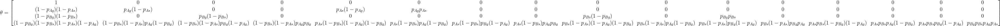

```{r setup, include=FALSE}
knitr::opts_chunk$set(echo = TRUE, results = 'hide', 
                      dpi = 300, 
                      cache = TRUE)
library(tidyverse)
theme_set(theme_light())
library(sf)
library(nimble)
```
# An ounce of theory

We consider a two-species static occupancy model à la [Rota et al. (2016)](https://besjournals.onlinelibrary.wiley.com/doi/full/10.1111/2041-210X.12587). 

Ignoring the site index, we use the following notation for the occupancy probabilities:

* $\psi_{11}$ is the prob. that species A and species B are both present;  
* $\psi_{10}$ is the prob. that species A is present and species B is absent;
* $\psi_{01}$ is the prob. that species A is absent and species B is present;
* $\psi_{00}$ is the prob. that species A and species B are both absent,
with avec $\psi_{11} + \psi_{10} + \psi_{01} + \psi_{00} = 1.$

The marginal probabilities of occupancy are:

* $\Pr(z_A = 1) = \Pr(\mbox{species A is present}) = \psi_{10} + \psi_{11}$
* $\Pr(z_B = 1) = \Pr(\mbox{species B is present}) = \psi_{01} + \psi_{11}$
* $\Pr(z_A = 0) = \Pr(\mbox{species A is absent}) = \psi_{01} + \psi_{00}$
* $\Pr(z_B = 0) = \Pr(\mbox{species B is absent}) = \psi_{10} + \psi_{00}$

And the conditional probabilities (reminder: $\Pr(\mbox{A|B}) = \Pr(\mbox{A and B})/\Pr(\mbox{B})$):

* $\Pr(z_A = 1 | z_B = 0) = \psi_{10} / (\psi_{10} + \psi_{00}) = \Pr(\mbox{species A is present given species B is absent});$
* $\Pr(z_A = 1 | z_B = 1) = \psi_{11} / (\psi_{11} + \psi_{01}) = \Pr(\mbox{species A is present given species B is present});$
* $\Pr(z_B = 1 | z_A = 0) = \psi_{01} / (\psi_{01} + \psi_{00}) = \Pr(\mbox{species B is present given species A is absent});$
* $\Pr(z_B = 1 | z_A = 1) = \psi_{11} / (\psi_{11} + \psi_{10}) = \Pr(\mbox{species B is present given species A is present}).$

In this document, we adapted the multi-species occupancy to integrate two datasets. We considered dataset `S` (e.g SAMM aerial line transects), and dataset `G` (e.g. GDEGeM boat search-encounter program). Both monitoring collected detection / non-detection about species A and B. Then, each species has a different detection probability depending on the monitoring program considered. For example, $p_{Ag}$ is the probability of detecting species A by monitoring program 'g'. Then, 16 observation 'event' can occur. We coded them:

  * `1` for none species detected neither by G nor S
  * `2` for species A detected by G, nothing by S
  * `3` for species B detected by G, nothing by S
  * `4` for both species detected by G, nothing by S
  * `5` for none species detected neither by G, species A detected by S
  * `6` for species A detected by G, species A detected by S
  * `7` for species B detected by G, species A detected by S
  * `8` for both species detected by G, species A detected by S
  * `9` for none species detected neither by G, species B detected by S
  * `10` for species A detected by G, species B detected by S
  * `11` for species B detected by G, species B detected by S
  * `12` for both species detected by G, species B detected by S
  * `13` for none species detected neither by G, both species detected by S
  * `14` for species A detected by G, both species detected by S
  * `15` for species B detected by G, both species detected by S
  * `16` for both species detected by G, both species detected by S
  
From the 4 ecological states and the 16 observation events, we obtaine the observation process with the following 4x16 matrix.


```{r eval=FALSE, include=FALSE}
$$\theta = \begin{bmatrix} 1 & 0& 0& 0& 0& 0& 0& 0& 0& 0& 0& 0& 0& 0& 0& 0\\
(1 - p_{Ag})(1 - p_{As}) & p_{Ag}(1- p_{As}) &0 &0 & p_{As}(1-p_{Ag}) &p_{Ag}p_{As} &0 &0 &0 &0&0 &0&0 &0&0 &0\\
(1 - p_{Bg})(1 - p_{Bs}) &0 & p_{Bg}(1- p_{Bs}) &0 &0 &0 &0 &0 &p_{Bs}(1-p_{Bg}) &0 &p_{Bg}p_{Bs}&0 &0&0 &0&0 \\

(1 - p_{Bg})(1 - p_{Bs})(1 - p_{As})(1 - p_{Ag}) &(1 - p_{Bs})(1 - p_{As})p_{Ag}(1-p_{Bg}) &(1 - p_{Bs})(1 - p_{As})p_{Bg}(1-p_{Ag}) &(1 - p_{Bs})(1 - p_{As})p_{Ag}p_{Bg} &p_{As}(1-p_{Bs})(1-p_{Ag})(1-p_{Bg}) &p_{As}(1-p_{Bs})p_{Ag}(1-p_{Bg}) &p_{As}(1-p_{Bs})p_{Bg}(1-p_{Ag}) &p_{As}(1-p_{Bs})p_{Ag}p_{Bg} &p_{Bs}(1-p_{As})(1-p_{Ag})(1-p_{Bg}) &p_{Bs}(1-p_{As})p_{Ag}(1-p_{Bg}) &p_{Bs}(1-p_{As})p_{Bg}(1-p_{Ag}) &p_{Bs}(1-p_{As})p_{Bg}p_{Ag} &p_{As}p_{Bs}(1-p_{Bg})(1-p_{Ag}) &p_{As}p_{Bs}p_{Ag}(1-p_{Bg}) &p_{As}p_{Bs}p_{Bg}(1-p_{Ag}) &p_{Bg}p_{Bs}p_{Ag}p_{As}
\end{bmatrix}$$
```


Let's go for the analysis.

# Format and visualise data 

Load grid and occupancy data.
```{r message=FALSE, warning=FALSE}
load("pays.rdata")
grid <- st_read("Grid/grid.shp") %>% st_transform(crs = st_crs(pays))
# focus Golfe du Lion
grid <-  grid %>% st_crop(xmin = 700000, xmax = 900000, ymin = 6140000, ymax = 6300000) 
pays <- pays %>% st_crop(st_bbox(grid))

# SAMM data
load('msoccu_samm.rdata')
multioccu_samm$dauphins <- st_transform(multioccu_samm$dauphins, st_crs(grid))
multioccu_samm$chalut <- st_transform(multioccu_samm$chalut, st_crs(grid))
multioccu_samm$effort <- st_transform(multioccu_samm$effort, st_crs(grid))

# GDEGeM data
load('msoccu_gd.rdata')
multioccu_gd$dauphins <- st_transform(multioccu_gd$dauphins, st_crs(grid))
multioccu_gd$chalut <-   st_transform(multioccu_gd$chalut, st_crs(grid))
multioccu_gd$effort <-   st_transform(multioccu_gd$effort, st_crs(grid))
```

## SAMM 


Visualise data.
```{r message=FALSE, warning=FALSE}
dfS <- bind_rows(multioccu_samm$dauphins %>% add_column(species = "dauphin"), 
          multioccu_samm$chalut %>% add_column(species = "chalutier")) %>% 
  st_crop(st_bbox(grid))

```

Build datasets. 
```{r message=FALSE, warning=FALSE}
# sampling effort
effortS <- multioccu_samm$effort %>% 
  st_crop(st_bbox(grid)) %>% 
  select(autumn:summer) %>%
  as_tibble() %>%
  select(-geometry) %>% 
  as.matrix()

# dolphin detections/non-detections

y_dolphinS <- dfS %>% 
  filter(species == "dauphin") %>%
  select(autumn:summer) %>%
  as_tibble() %>%
  select(-geometry) %>% 
  as.matrix()
y_dolphinS[effortS == 0] <- NA
## ind_dolphinS <- apply(y_dolphinS, 1, function(x) all(is.na(x)))
## y_dolphinS <- y_dolphinS[ !ind_dolphinS, ]

# fishing boats detections/non-detections
y_fishingS <- dfS %>% 
  filter(species == "chalutier") %>%
  select(autumn:summer) %>%
  as_tibble() %>%
  select(-geometry) %>% 
  as.matrix()
y_fishingS[effortS == 0] <- NA
## ind_fishingS <- apply(y_fishingS, 1, function(x) all(is.na(x)))
## y_fishingS <- y_fishingS[ !ind_fishingS, ]

# grid cells coordinates
coordS <- dfS %>% 
  filter(species == "dauphin") %>%
  select(autumn:summer) %>%
  st_centroid() %>%
  st_coordinates() %>%
  as_tibble() %>%
  mutate(easting = (X - mean(X)) / sd(X), 
         northing = (Y - mean(Y)) / sd(Y)) %>%
  select(easting, northing) %>%
  as.matrix()
## maskS <- apply(effortS == 0, 1, sum) == 4
## coordS <- coordS[!maskS,]
dim(coordS)

# means and standard deviations used to standardise the grid cells coordinates
tempS <- dfS %>% 
  filter(species == "dauphin") %>%
  st_centroid() %>%
  st_coordinates() %>%
  as.matrix() 
meanXS <- mean(tempS[,1])
sdXS <- sd(tempS[,1])
meanYS <- mean(tempS[,2])
sdYS <- sd(tempS[,2])
```


## GDEGeM
Visualise data.
```{r message=FALSE, warning=FALSE}
dfG <- bind_rows(multioccu_gd$dauphins %>% add_column(species = "dauphin"), 
          multioccu_gd$chalut %>% add_column(species = "chalutier")) %>% 
  st_crop(st_bbox(grid))

```

Build datasets. 
```{r message=FALSE, warning=FALSE}
# sampling effort
effortG <- multioccu_gd$effort %>% 
  st_crop(st_bbox(grid)) %>% 
  select(autumn:summer) %>%
  as_tibble() %>%
  select(-geometry) %>% 
  as.matrix()

# dolphin detections/non-detections

y_dolphinG <- dfG %>% 
  filter(species == "dauphin") %>%
  select(autumn:summer) %>%
  as_tibble() %>%
  select(-geometry) %>% 
  as.matrix()
y_dolphinG[effortG == 0] <- NA
## ind_dolphinG <- apply(y_dolphinG, 1, function(x) all(is.na(x)))
## y_dolphinG <- y_dolphinG[ !ind_dolphinG, ]

# fishing boats detections/non-detections
y_fishingG <- dfG %>% 
  filter(species == "chalutier") %>%
  select(autumn:summer) %>%
  as_tibble() %>%
  select(-geometry) %>% 
  as.matrix()
y_fishingG[effortG == 0] <- NA
## ind_fishingG <- apply(y_fishingG, 1, function(x) all(is.na(x)))
## y_fishingG <- y_fishingG[ !ind_fishingG, ]

# grid cells coordinates
coordG <- dfG %>% 
  filter(species == "dauphin") %>%
  select(autumn:summer) %>%
  st_centroid() %>%
  st_coordinates() %>%
  as_tibble() %>%
  mutate(easting = (X - mean(X)) / sd(X), 
         northing = (Y - mean(Y)) / sd(Y)) %>%
  select(easting, northing) %>%
  as.matrix()
## maskG <- apply(effortG == 0, 1, sum) == 4
## coordG <- coordG[!maskG,]
dim(coordG)

# means and standard deviations used to standardise the grid cells coordinates
tempG <- dfG %>% 
  filter(species == "dauphin") %>%
  st_centroid() %>%
  st_coordinates() %>%
  as.matrix() 
meanXG <- mean(tempG[,1])
sdXG <- sd(tempG[,1])
meanYG <- mean(tempG[,2])
sdYG <- sd(tempG[,2])
```

## Joining the dataset and formatting for Bayesian analyses

Format data.
```{r message=FALSE, warning=FALSE}
yS <- list(y_dolphinS, y_fishingS)
yG <- list(y_dolphinG, y_fishingG)
names(yS) <- names(yS) <-  c('dolphin','fishing')

## ind_effortS <- apply(effortS, 1, sum)
cov_effortS <- effortS
cov_effortS[cov_effortS == 0] <- NA
st_effortS <- matrix(scale(cov_effortS), ncol = 4)

## ind_effortG <- apply(effortG, 1, sum)
cov_effortG <- effortG
cov_effortG[cov_effortG == 0] <- NA
st_effortG <- matrix(scale(cov_effortG), ncol = 4)
```

Let's format the data in a matrix with $N$ rows (sites) and $J$ columns (surveys) with in each cell a `1:16` for the observation (or event in the capture-recapture terminology) `none species detected`, `species A detected`, `species B detected`, `both species detected` and each of these event by either by SAMM only, by GDEGeM onyl, or by both monitoring programs.  

```{r message=FALSE, warning=FALSE}
str(yS)
str(yG)
N <- nrow(yS[[1]])
J <- ncol(yG[[1]])
y_jagsS <- y_jagsG <- y_jags <-  matrix(NA, nrow = N, ncol = J)

# SAMM
for (j in 1:N){ #nsites
  for (k in 1:J){ #nocc
    if (is.na(yS[[1]][j,k])) next # if cell j is not sampled at occasion k, then next
    if (yS[[1]][j,k] == 0 & yS[[2]][j,k] == 0) y_jagsS[j,k] <- 1
    if (yS[[1]][j,k] == 1 & yS[[2]][j,k] == 0) y_jagsS[j,k] <- 2
    if (yS[[1]][j,k] == 0 & yS[[2]][j,k] == 1) y_jagsS[j,k] <- 3
    if (yS[[1]][j,k] == 1 & yS[[2]][j,k] == 1) y_jagsS[j,k] <- 4
  }
}

# GDEGeM
for (j in 1:N){ #nsites
  for (k in 1:J){ #nocc
    if (is.na(yG[[1]][j,k])) next # if cell j is not sampled at occasion k, then next
    if (yG[[1]][j,k] == 0 & yG[[2]][j,k] == 0) y_jagsG[j,k] <- 1
    if (yG[[1]][j,k] == 1 & yG[[2]][j,k] == 0) y_jagsG[j,k] <- 2
    if (yG[[1]][j,k] == 0 & yG[[2]][j,k] == 1) y_jagsG[j,k] <- 3
    if (yG[[1]][j,k] == 1 & yG[[2]][j,k] == 1) y_jagsG[j,k] <- 4
  }
}

head(y_jagsS, 25)
dim(y_jagsS)
dim(y_jagsG)
dim(st_effortG)
dim(st_effortS)
# Before joining, we do a trick to deal with NAs. We replace the NAs by 0 in where the couple site x occasion has been sampled by the other monitoring device

# for SAMM
backgdG <- st_effortG
backgdG[ !is.na(backgdG)] <- 0 # create a background matrix with the sampling effort of GDEGeM
y2S <- backgdG
y2S[ !is.na(y_jagsS)] <- y_jagsS[ !is.na(y_jagsS)] # add the detection of SAMM

# for GDEGeM
backgdS <- st_effortS
backgdS[ !is.na(backgdS)] <- 0 # create a background matrix with the sampling effort of SAMM
y2G <- backgdS
y2G[ !is.na(y_jagsG)] <- y_jagsG[ !is.na(y_jagsG)] # add the detection of GDEGeM
#length(which(y2G==0))/4

# Join the two matrix
# reminder 1 -> no detection, 2 -> dolphin, 3 -> fishing, 4 -> both species , ++ 0 -> no detection but site sampled
for (j in 1:N){ #nsites
  for (k in 1:J){ #nocc
    if (is.na(y2G[j,k]) & is.na(y2S[j,k])) next
    if (y2G[j,k] <= 1 & y2S[j,k] <= 1) y_jags[j,k] <- 1
    if (y2G[j,k] == 2 & y2S[j,k] <= 1) y_jags[j,k] <- 2
    if (y2G[j,k] == 3 & y2S[j,k] <= 1) y_jags[j,k] <- 3
    if (y2G[j,k] == 4 & y2S[j,k] <= 1) y_jags[j,k] <- 4
    if (y2G[j,k] <= 1 & y2S[j,k] == 2) y_jags[j,k] <- 5
    if (y2G[j,k] == 2 & y2S[j,k] == 2) y_jags[j,k] <- 6
    if (y2G[j,k] == 3 & y2S[j,k] == 2) y_jags[j,k] <- 7
    if (y2G[j,k] == 4 & y2S[j,k] == 2) y_jags[j,k] <- 8
    if (y2G[j,k] <= 1 & y2S[j,k] == 3) y_jags[j,k] <- 9
    if (y2G[j,k] == 2 & y2S[j,k] == 3) y_jags[j,k] <- 10
    if (y2G[j,k] == 3 & y2S[j,k] == 3) y_jags[j,k] <- 11
    if (y2G[j,k] == 4 & y2S[j,k] == 3) y_jags[j,k] <- 12
    if (y2G[j,k] <= 1 & y2S[j,k] == 4) y_jags[j,k] <- 13
    if (y2G[j,k] == 2 & y2S[j,k] == 4) y_jags[j,k] <- 14
    if (y2G[j,k] == 3 & y2S[j,k] == 4) y_jags[j,k] <- 15
    if (y2G[j,k] == 4 & y2S[j,k] == 4) y_jags[j,k] <- 16
  }
}

# apply mask to remove site without sampling effort from none of the monitoring program
 ind_effort <- apply(y_jags, 1, function(x) all(is.na(x)))
 y <- y_jags[ !ind_effort, ]
 seffG <- st_effortG[ !ind_effort, ]
 seffS <- st_effortS[ !ind_effort, ]
 effindG <- seffG
 effindG[is.na(effindG)] <- 0
 effindG[effindG !=0] <- 1
 
  effindS <- seffS
 effindS[is.na(effindS)] <- 0
 effindS[effindS !=0] <- 1
 
 seffG[is.na(seffG)] <- 0
 seffS[is.na(seffS)] <- 0
 
# same mask with coordG,coordS
 coordMask <- coordG[ !ind_effort, ]
```

# Simplest integrated MSO

## BUGS model 

### JAGS

I did not display JAGS process although I made it work in the .Rmd file.  

```{r eval = FALSE, include=FALSE}
modelIMSO <- function() { 
  
  ## state process
  for(j in 1:nsite) {
    z[j] ~ dcat(psi[1:4])
  }
  
  # occupancy probabilities
  psi[1] <- 1 / (1 + sum(prop[1:3])) # unoccupied
  psi[2] <- prop[1] / (1 + sum(prop[1:3])) # occupied by species A and not B
  psi[3] <- prop[2] / (1 + sum(prop[1:3])) # occupied by species B and not A
  psi[4] <- prop[3] / (1 + sum(prop[1:3])) # occupied by both species A and B
  
  ## observation process
  for(j in 1:nsite) {
    for(k in 1:nyear) {
      y[j, k] ~ dcat(obs[j, k, 1:16, z[j]])
    }
  }
  
  # detection matrix with obs for observations and state = true states
  # obs take values: 
  ## VL: INSANE 
  ## Let's have a bit of explanation, we have species A, and B. We have monitoring S through SAMM, and G through GDEGeM
  ## Then, we have 16 different situations
  # 1 for none species detected neither by G nor S
  # 2 for species A detected by G, nothing by S
  # 3 for species B detected by G, nothing by S
  # 4 for both species detected by G, nothing by S
  
  # 5 for none species detected neither by G, species A detected by S
  # 6 for species A detected by G, species A detected by S
  # 7 for species B detected by G, species A detected by S
  # 8 for both species detected by G, species A detected by S
  
  # 9 for none species detected neither by G, species B detected by S
  # 10 for species A detected by G, species B detected by S
  # 11 for species B detected by G, species B detected by S
  # 12 for both species detected by G, species B detected by S
  
  # 13 for none species detected neither by G, both species detected by S
  # 14 for species A detected by G, both species detected by S
  # 15 for species B detected by G, both species detected by S
  # 16 for both species detected by G, both species detected by S
  
  # given state = unoccupied,
  for(j in 1:nsite) {
    for(k in 1:nyear) {
      # state 1 = no species use the site
      obs[j, k, 1,  1] <- 1 # prob obs = 1 
      obs[j, k, 2,  1] <- 0 # prob obs = 2
      obs[j, k, 3,  1] <- 0 # prob obs = 3
      obs[j, k, 4,  1] <- 0 # prob obs = 4
      obs[j, k, 5,  1] <- 0 # prob obs = 5 
      obs[j, k, 6,  1] <- 0 # prob obs = 6
      obs[j, k, 7,  1] <- 0 # prob obs = 7
      obs[j, k, 8,  1] <- 0 # prob obs = 8
      obs[j, k, 9,  1] <- 0 # prob obs = 9 
      obs[j, k, 10, 1] <- 0 # prob obs = 10
      obs[j, k, 11, 1] <- 0 # prob obs = 11
      obs[j, k, 12, 1] <- 0 # prob obs = 12
      obs[j, k, 13, 1] <- 0 # prob obs = 13 
      obs[j, k, 14, 1] <- 0 # prob obs = 14
      obs[j, k, 15, 1] <- 0 # prob obs = 15
      obs[j, k, 16, 1] <- 0 # prob obs = 16
      
      # given state 2 = occupied by species A and not B,
      obs[j, k, 1,  2] <- 1 - pAg[j,k] - pAs[j,k] + pAg[j,k] * pAs[j,k] # prob obs = 1 
      obs[j, k, 2,  2] <- pAg[j,k] * (1 - pAs[j,k]) # prob obs = 2
      obs[j, k, 3,  2] <- 0 # prob obs = 3
      obs[j, k, 4,  2] <- 0 # prob obs = 4
      obs[j, k, 5,  2] <- pAs[j,k] * (1 - pAg[j,k]) # prob obs = 5 
      obs[j, k, 6,  2] <- pAs[j,k] * pAg[j,k] # prob obs = 6
      obs[j, k, 7,  2] <- 0 # prob obs = 7
      obs[j, k, 8,  2] <- 0 # prob obs = 8
      obs[j, k, 9,  2] <- 0 # prob obs = 9 
      obs[j, k, 10, 2] <- 0 # prob obs = 10
      obs[j, k, 11, 2] <- 0 # prob obs = 11
      obs[j, k, 12, 2] <- 0 # prob obs = 12
      obs[j, k, 13, 2] <- 0 # prob obs = 13 
      obs[j, k, 14, 2] <- 0 # prob obs = 14
      obs[j, k, 15, 2] <- 0 # prob obs = 15
      obs[j, k, 16, 2] <- 0 # prob obs = 16
      
      # given state 3 = occupied by species B and not A,
      obs[j, k, 1,  3] <- 1 - pBg[j,k] - pBs[j,k] + pBg[j,k] * pBs[j,k] # prob obs = 1 
      obs[j, k, 2,  3] <- 0 # prob obs = 2
      obs[j, k, 3,  3] <- pBg[j,k] * (1 - pBs[j,k]) # prob obs = 3
      obs[j, k, 4,  3] <- 0 # prob obs = 4
      obs[j, k, 5,  3] <- 0 # prob obs = 5 
      obs[j, k, 6,  3] <- 0 # prob obs = 6
      obs[j, k, 7,  3] <- 0 # prob obs = 7
      obs[j, k, 8,  3] <- 0 # prob obs = 8
      obs[j, k, 9,  3] <- pBs[j,k] * (1 - pBg[j,k]) # prob obs = 9 
      obs[j, k, 10, 3] <- 0 # prob obs = 10
      obs[j, k, 11, 3] <- pBs[j,k] * pBg[j,k] # prob obs = 11
      obs[j, k, 12, 3] <- 0 # prob obs = 12
      obs[j, k, 13, 3] <- 0 # prob obs = 13 
      obs[j, k, 14, 3] <- 0 # prob obs = 14
      obs[j, k, 15, 3] <- 0 # prob obs = 15
      obs[j, k, 16, 3] <- 0 # prob obs = 16
      
      # given state 4 = occupied by both species B and A,
      # VL: Now it's fun...
      obs[j, k, 1,  4] <- (1 - pAs[j,k]) * (1 - pAg[j,k]) * (1- pBs[j,k]) * (1 - pBg[j,k]) # prob obs = 1 
      obs[j, k, 2,  4] <- (1 - pAs[j,k]) * (1 - pBs[j,k]) * pAg[j,k] * (1 - pBg[j,k]) # prob obs = 2
      obs[j, k, 3,  4] <- (1 - pAs[j,k]) * (1 - pBs[j,k]) * pBg[j,k] * (1 - pAg[j,k]) # prob obs = 3
      obs[j, k, 4,  4] <- (1 - pAs[j,k]) * (1 - pBs[j,k]) * pAg[j,k] * pBg[j,k]   # prob obs = 4
      obs[j, k, 5,  4] <- pAs[j,k]*(1 - pBs[j,k]) * (1 - pAg[j,k]) * (1 - pBg[j,k]) ### # prob obs = 5 
      obs[j, k, 6,  4] <- pAs[j,k]*(1 - pBs[j,k]) * pAg[j,k] * (1 - pBg[j,k])  # pr ### # prob obs = 6
      obs[j, k, 7,  4] <- pAs[j,k]*(1 - pBs[j,k]) * pBg[j,k] * (1 - pAg[j,k]) # pro ### # prob obs = 7
      obs[j, k, 8,  4] <- pAs[j,k]*(1 - pBs[j,k]) * pAg[j,k] * pBg[j,k]  # prob obs ### # prob obs = 8
      obs[j, k, 9,  4] <- pBs[j,k]*(1 - pAs[j,k]) * (1 - pAg[j,k]) * (1 - pBg[j,k])  # prob obs = 9 
      obs[j, k, 10, 4] <- pBs[j,k]*(1 - pAs[j,k]) * pAg[j,k] * (1 - pBg[j,k])  # prob obs = 10
      obs[j, k, 11, 4] <- pBs[j,k]*(1 - pAs[j,k]) * pBg[j,k] * (1 - pAg[j,k]) # prob obs = 11
      obs[j, k, 12, 4] <- pBs[j,k]*(1 - pAs[j,k]) * pAg[j,k] * pBg[j,k]  # prob obs = 12
      obs[j, k, 13, 4] <- pAs[j,k] * pBs[j,k] * (1 - pAg[j,k]) * (1 - pBg[j,k]) # prob obs = 13 
      obs[j, k, 14, 4] <- pAs[j,k] * pBs[j,k] * pAg[j,k] * (1 - pBg[j,k]) # prob obs = 14
      obs[j, k, 15, 4] <- pAs[j,k] * pBs[j,k] * pBg[j,k] * (1 - pAg[j,k]) # prob obs = 15
      obs[j, k, 16, 4] <- pAs[j,k] * pAg[j,k] * pBs[j,k] * pBg[j,k] # prob obs = 16
    }
  }  
 ## priors for...
  # occupancy probabilities
  for (i in 1:3){
    log(prop[i]) <- theta[i] 
    theta[i] ~ dnorm(0,1) 
  }
  
  # detection probabilities (pA function of pres/abs of B, as in Waddle et al 2010 page 1470)
  # VL: There are four detections probabilities now pAs, pAg, pBg, pBs
  for(j in 1:nsite) {
    for(k in 1:nyear) {
    pAs[j, k] <- exp(beta[1] + beta[2] * effS[j, k])/(1 + exp(beta[1] + beta[2] * effS[j, k]))*effindS[j,k]  #  logit(pAs[j, k]) <- beta[1] + beta[2] * effS[j, k] 
    pBs[j, k] <- exp(beta[3] + beta[4] * effS[j, k])/(1 + exp(beta[3] + beta[4] * effS[j, k]))*effindS[j,k]  #  logit(pBs[j, k]) <- beta[3] + beta[4] * effS[j, k]
    pAg[j, k] <- exp(beta[5] + beta[6] * effG[j, k])/(1 + exp(beta[5] + beta[6] * effG[j, k]))*effindG[j,k]  #  logit(pAg[j, k]) <- beta[5] + beta[6] * effG[j, k] 
    pBg[j, k] <- exp(beta[7] + beta[8] * effG[j, k])/(1 + exp(beta[7] + beta[8] * effG[j, k]))*effindG[j,k]  #  logit(pBg[j, k]) <- beta[7] + beta[8] * effG[j, k]
    }
  }
  for (i in 1:8){
    beta[i] ~ dnorm(0,1)
  }
}

data <- list(y = y, 
             nsite = dim(y)[1], 
             nyear = dim(y)[2],
             effS = seffS,
             effG = seffG,
             effindS = effindS,
             effindG = effindG)

```

Initial values.
```{r eval = FALSE , include=FALSE}
# Initial values for z {1:4} have to be consistent with the detection {1:16}
# To remain simple with put z = 4 as initial value if smth is detected
zinit <- apply(data$y, 1, max, na.rm = TRUE)
zinit[zinit>1] <- rep(length(zinit[zinit>1]),4)

inits <- function() {list(z = zinit, 
                          beta = rnorm(8, 0, 1), 
                          theta = rnorm(3, 0, 1))}
```

Parameters to be monitored.
```{r eval = FALSE, include=FALSE}
params <- c("prop","theta","beta")
```

MCMC settings
```{r eval = FALSE, include=FALSE}
ni <- 1000
nb <- 250
nc <- 1
```

Run `Jags` from `R`.
```{r eval = FALSE, include=FALSE}
library(R2jags)
ptm <- proc.time()
out2 <- jags(data = data, 
            inits = inits, 
            parameters.to.save = params, 
            model.file = modelIMSO, 
            n.chains = nc, 
            n.iter = ni, 
            n.burnin = nb)
x2 <- proc.time() -  ptm
x2 # 15 minutes
save(x2, out2, file = "runwochalutier_gdegem.RData")
```

Check convergence.
```{r eval = FALSE, include=FALSE}
jagsfit.mcmc <- as.mcmc(out2$BUGSoutput$sims.matrix)
library(lattice)
xyplot(jagsfit.mcmc, layout=c(4,3))
```

### NIMBLE

```{r eval = FALSE}
IMSO <- nimbleCode({ 
  
  ## state process
  for(j in 1:nsite) {
    z[j] ~ dcat(psi[1:4])
  }
  
  # occupancy probabilities
  psi[1] <- 1 / (1 + sum(prop[1:3])) # unoccupied
  psi[2] <- prop[1] / (1 + sum(prop[1:3])) # occupied by species A and not B
  psi[3] <- prop[2] / (1 + sum(prop[1:3])) # occupied by species B and not A
  psi[4] <- prop[3] / (1 + sum(prop[1:3])) # occupied by both species A and B
  
  ## observation process
  for(j in 1:nsite) {
    for(k in 1:nyear) {
      y[j, k] ~ dcat(obs[j, k, 1:16, z[j]])
    }
  }
  
  # detection matrix with obs for observations and state = true states
  # obs take values: 
  ## VL: INSANE 
  ## Let's have a bit of explanation, we have species A, and B. We have monitoring S through SAMM, and G through GDEGeM
  ## Then, we have 16 different situations
  # 1 for none species detected neither by G nor S
  # 2 for species A detected by G, nothing by S
  # 3 for species B detected by G, nothing by S
  # 4 for both species detected by G, nothing by S
  
  # 5 for none species detected neither by G, species A detected by S
  # 6 for species A detected by G, species A detected by S
  # 7 for species B detected by G, species A detected by S
  # 8 for both species detected by G, species A detected by S
  
  # 9 for none species detected neither by G, species B detected by S
  # 10 for species A detected by G, species B detected by S
  # 11 for species B detected by G, species B detected by S
  # 12 for both species detected by G, species B detected by S
  
  # 13 for none species detected neither by G, both species detected by S
  # 14 for species A detected by G, both species detected by S
  # 15 for species B detected by G, both species detected by S
  # 16 for both species detected by G, both species detected by S
  
  # given state = unoccupied,
  for(j in 1:nsite) {
    for(k in 1:nyear) {
      # state 1 = no species use the site
      obs[j, k, 1,  1] <- 1 # prob obs = 1 
      obs[j, k, 2,  1] <- 0 # prob obs = 2
      obs[j, k, 3,  1] <- 0 # prob obs = 3
      obs[j, k, 4,  1] <- 0 # prob obs = 4
      obs[j, k, 5,  1] <- 0 # prob obs = 5 
      obs[j, k, 6,  1] <- 0 # prob obs = 6
      obs[j, k, 7,  1] <- 0 # prob obs = 7
      obs[j, k, 8,  1] <- 0 # prob obs = 8
      obs[j, k, 9,  1] <- 0 # prob obs = 9 
      obs[j, k, 10, 1] <- 0 # prob obs = 10
      obs[j, k, 11, 1] <- 0 # prob obs = 11
      obs[j, k, 12, 1] <- 0 # prob obs = 12
      obs[j, k, 13, 1] <- 0 # prob obs = 13 
      obs[j, k, 14, 1] <- 0 # prob obs = 14
      obs[j, k, 15, 1] <- 0 # prob obs = 15
      obs[j, k, 16, 1] <- 0 # prob obs = 16
      
      # given state 2 = occupied by species A and not B,
      obs[j, k, 1,  2] <- 1 - pAg[j,k] - pAs[j,k] + pAg[j,k] * pAs[j,k] # prob obs = 1 
      obs[j, k, 2,  2] <- pAg[j,k] * (1 - pAs[j,k]) # prob obs = 2
      obs[j, k, 3,  2] <- 0 # prob obs = 3
      obs[j, k, 4,  2] <- 0 # prob obs = 4
      obs[j, k, 5,  2] <- pAs[j,k] * (1 - pAg[j,k]) # prob obs = 5 
      obs[j, k, 6,  2] <- pAs[j,k] * pAg[j,k] # prob obs = 6
      obs[j, k, 7,  2] <- 0 # prob obs = 7
      obs[j, k, 8,  2] <- 0 # prob obs = 8
      obs[j, k, 9,  2] <- 0 # prob obs = 9 
      obs[j, k, 10, 2] <- 0 # prob obs = 10
      obs[j, k, 11, 2] <- 0 # prob obs = 11
      obs[j, k, 12, 2] <- 0 # prob obs = 12
      obs[j, k, 13, 2] <- 0 # prob obs = 13 
      obs[j, k, 14, 2] <- 0 # prob obs = 14
      obs[j, k, 15, 2] <- 0 # prob obs = 15
      obs[j, k, 16, 2] <- 0 # prob obs = 16
      
      # given state 3 = occupied by species B and not A,
      obs[j, k, 1,  3] <- 1 - pBg[j,k] - pBs[j,k] + pBg[j,k] * pBs[j,k] # prob obs = 1 
      obs[j, k, 2,  3] <- 0 # prob obs = 2
      obs[j, k, 3,  3] <- pBg[j,k] * (1 - pBs[j,k]) # prob obs = 3
      obs[j, k, 4,  3] <- 0 # prob obs = 4
      obs[j, k, 5,  3] <- 0 # prob obs = 5 
      obs[j, k, 6,  3] <- 0 # prob obs = 6
      obs[j, k, 7,  3] <- 0 # prob obs = 7
      obs[j, k, 8,  3] <- 0 # prob obs = 8
      obs[j, k, 9,  3] <- pBs[j,k] * (1 - pBg[j,k]) # prob obs = 9 
      obs[j, k, 10, 3] <- 0 # prob obs = 10
      obs[j, k, 11, 3] <- pBs[j,k] * pBg[j,k] # prob obs = 11
      obs[j, k, 12, 3] <- 0 # prob obs = 12
      obs[j, k, 13, 3] <- 0 # prob obs = 13 
      obs[j, k, 14, 3] <- 0 # prob obs = 14
      obs[j, k, 15, 3] <- 0 # prob obs = 15
      obs[j, k, 16, 3] <- 0 # prob obs = 16
      
      # given state 4 = occupied by both species B and A,
      # VL: Now it's fun...
      obs[j, k, 1,  4] <- (1 - pAs[j,k]) * (1 - pAg[j,k]) * (1- pBs[j,k]) * (1 - pBg[j,k]) # prob obs = 1 
      obs[j, k, 2,  4] <- (1 - pAs[j,k]) * (1 - pBs[j,k]) * pAg[j,k] * (1 - pBg[j,k]) # prob obs = 2
      obs[j, k, 3,  4] <- (1 - pAs[j,k]) * (1 - pBs[j,k]) * pBg[j,k] * (1 - pAg[j,k]) # prob obs = 3
      obs[j, k, 4,  4] <- (1 - pAs[j,k]) * (1 - pBs[j,k]) * pAg[j,k] * pBg[j,k]   # prob obs = 4
      obs[j, k, 5,  4] <- pAs[j,k]*(1 - pBs[j,k]) * (1 - pAg[j,k]) * (1 - pBg[j,k]) ### # prob obs = 5 
      obs[j, k, 6,  4] <- pAs[j,k]*(1 - pBs[j,k]) * pAg[j,k] * (1 - pBg[j,k])  # pr ### # prob obs = 6
      obs[j, k, 7,  4] <- pAs[j,k]*(1 - pBs[j,k]) * pBg[j,k] * (1 - pAg[j,k]) # pro ### # prob obs = 7
      obs[j, k, 8,  4] <- pAs[j,k]*(1 - pBs[j,k]) * pAg[j,k] * pBg[j,k]  # prob obs ### # prob obs = 8
      obs[j, k, 9,  4] <- pBs[j,k]*(1 - pAs[j,k]) * (1 - pAg[j,k]) * (1 - pBg[j,k])  # prob obs = 9 
      obs[j, k, 10, 4] <- pBs[j,k]*(1 - pAs[j,k]) * pAg[j,k] * (1 - pBg[j,k])  # prob obs = 10
      obs[j, k, 11, 4] <- pBs[j,k]*(1 - pAs[j,k]) * pBg[j,k] * (1 - pAg[j,k]) # prob obs = 11
      obs[j, k, 12, 4] <- pBs[j,k]*(1 - pAs[j,k]) * pAg[j,k] * pBg[j,k]  # prob obs = 12
      obs[j, k, 13, 4] <- pAs[j,k] * pBs[j,k] * (1 - pAg[j,k]) * (1 - pBg[j,k]) # prob obs = 13 
      obs[j, k, 14, 4] <- pAs[j,k] * pBs[j,k] * pAg[j,k] * (1 - pBg[j,k]) # prob obs = 14
      obs[j, k, 15, 4] <- pAs[j,k] * pBs[j,k] * pBg[j,k] * (1 - pAg[j,k]) # prob obs = 15
      obs[j, k, 16, 4] <- pAs[j,k] * pAg[j,k] * pBs[j,k] * pBg[j,k] # prob obs = 16
    }
  }  
 ## priors for...
  # occupancy probabilities
  for (i in 1:3){
    log(prop[i]) <- theta[i] 
    theta[i] ~ dnorm(0,1) 
  }
  
  # detection probabilities (pA function of pres/abs of B, as in Waddle et al 2010 page 1470)
  # VL: There are four detections probabilities now pAs, pAg, pBg, pBs
  for(j in 1:nsite) {
    for(k in 1:nyear) {
    pAs[j, k] <- exp(beta[1] + beta[2] * effS[j, k])/(1 + exp(beta[1] + beta[2] * effS[j, k]))*effindS[j,k]  #  logit(pAs[j, k]) <- beta[1] + beta[2] * effS[j, k] 
    pBs[j, k] <- exp(beta[3] + beta[4] * effS[j, k])/(1 + exp(beta[3] + beta[4] * effS[j, k]))*effindS[j,k]  #  logit(pBs[j, k]) <- beta[3] + beta[4] * effS[j, k]
    pAg[j, k] <- exp(beta[5] + beta[6] * effG[j, k])/(1 + exp(beta[5] + beta[6] * effG[j, k]))*effindG[j,k]  #  logit(pAg[j, k]) <- beta[5] + beta[6] * effG[j, k] 
    pBg[j, k] <- exp(beta[7] + beta[8] * effG[j, k])/(1 + exp(beta[7] + beta[8] * effG[j, k]))*effindG[j,k]  #  logit(pBg[j, k]) <- beta[7] + beta[8] * effG[j, k]
    }
  }
  for (i in 1:8){
    beta[i] ~ dnorm(0,1)
  }
})
```

#### Bundle data

Specify data, initial values, parameters to be monitored and various MCMC details:

```{r eval = FALSE}
# nimble
y[is.na(y)] <-  1
data <- list(y = y, 
             effS = seffS,
             effG = seffG,
             effindS = effindS,
             effindG = effindG)

constants <- list(nsite = dim(y)[1], 
             nyear = dim(y)[2])

# Initial values for z {1:4} have to be consistent with the detection {1:16}
# To remain simple with put z = 4 as initial value if smth is detected
zinit <- apply(data$y, 1, max, na.rm = TRUE)
zinit[zinit>1] <- rep(4,length(zinit[zinit>1]))

inits <- list(z = zinit, 
                          beta = rnorm(8, 0, 1), 
                          theta = rnorm(3, 0, 1))
```


#### Build model 

```{r eval = FALSE}
Rmodel <- nimbleModel(IMSO, constants, data, inits)
Rmodel$initializeInfo()
Rmodel$calculate()

conf <- configureMCMC(Rmodel)
conf$printMonitors() 
conf$addMonitors("prop")

conf$printSamplers(byType= TRUE)

  # Build and compile MCMC
  Rmcmc <- buildMCMC(conf)
  Cmodel <- compileNimble(Rmodel)
  Cmcmc <- compileNimble(Rmcmc, project = Cmodel)
  
   t <- system.time(samples <- runMCMC(Cmcmc, niter = 1000, nburnin = 300, nchains = 1, samplesAsCodaMCMC = TRUE))
  
str(samples)

output <- coda::as.mcmc.list(samples)
mcmcplots::denplot(output)
```


# Full model w/ constant natural parameters, and GAM sur lat/long; detection is function of sampling effort plus dolphin detection function of pres/abs of fishing boats

Get the ingredients for GAMs using package `jagam` developed by Simon Wood and basically hacks what is built by the package `mgcv`.

```{r message=FALSE, warning=FALSE}
yy_dolphin <- apply(y, 1, max, na.rm = TRUE)
yy_dolphin[yy_dolphin ==1] <- 0
yy_dolphin[yy_dolphin >1] <- 1

coordx <- coordMask[,1]
coordy <- coordMask[,2]
library(mgcv)
res <- jagam(yy_dolphin ~ s(coordx, coordy, bs = "gp"), 
            family = "binomial",
            file = "psi.txt") # same structure for fishing boats and both together
#save(res, file = 'jagam.RData')
```

<!-- # model { -->
<!-- #   eta <- X %*% b ## linear predictor -->
<!-- #   for (i in 1:n) { mu[i] <-  ilogit(eta[i]) } ## expected response -->
<!-- #   for (i in 1:n) { y[i] ~ dbin(mu[i],w[i]) } ## response  -->
<!-- #   ## Parametric effect priors CHECK tau=1/10^2 is appropriate! -->
<!-- #   for (i in 1:1) { b[i] ~ dnorm(0,0.01) } -->
<!-- #   ## prior for s(coordx,coordy)...  -->
<!-- #   K1 <- S1[1:32,1:32] * lambda[1]  + S1[1:32,33:64] * lambda[2] -->
<!-- #   b[2:33] ~ dmnorm(zero[2:33],K1)  -->
<!-- #   ## smoothing parameter priors CHECK... -->
<!-- #   for (i in 1:2) { -->
<!-- #     lambda[i] ~ dgamma(.05,.005) -->
<!-- #     rho[i] <- log(lambda[i]) -->
<!-- #   } -->
<!-- # } -->


## NIMBLE

In this one, I did not display the NIMBLE process because I did not succeed to deal with the NIMBLE output. I'm not very confident with the GAM process... I just copy / paste Olivier's lines. :)

### BUGS model 
```{r eval = FALSE, include=FALSE }
IMSOfull <- nimbleCode({ 
  
  ## state process
  for(j in 1:nsite) {
    z[j] ~ dcat(psi[j, 1:4])
  }
  
  # occupancy probabilities
  for(j in 1:nsite) {
    psi[j, 1] <- 1 / (1 + sum(prop[j, 1:3])) # unoccupied
    psi[j, 2] <- prop[j, 1] / (1 + sum(prop[j, 1:3])) # occupied by species A and not B
    psi[j, 3] <- prop[j, 2] / (1 + sum(prop[j, 1:3])) # occupied by species B and not A
    psi[j, 4] <- prop[j, 3] / (1 + sum(prop[j, 1:3])) # occupied by both species A and B
  }
  
  ## observation process
  for(j in 1:nsite) {
    for(k in 1:nyear) {
      y[j, k] ~ dcat(obs[j, k, 1:16, z[j]])
    }
  }
  
  # detection matrix with obs for observations and state = true states
  # obs take values: 
  ## VL: INSANE 
  ## Let's have a bit of explanation, we have species A, and B. We have monitoring S through SAMM, and G through GDEGeM
  ## Then, we have 16 different situations
  # 1 for none species detected neither by G nor S
  # 2 for species A detected by G, nothing by S
  # 3 for species B detected by G, nothing by S
  # 4 for both species detected by G, nothing by S
  
  # 5 for none species detected neither by G, species A detected by S
  # 6 for species A detected by G, species A detected by S
  # 7 for species B detected by G, species A detected by S
  # 8 for both species detected by G, species A detected by S
  
  # 9 for none species detected neither by G, species B detected by S
  # 10 for species A detected by G, species B detected by S
  # 11 for species B detected by G, species B detected by S
  # 12 for both species detected by G, species B detected by S
  
  # 13 for none species detected neither by G, both species detected by S
  # 14 for species A detected by G, both species detected by S
  # 15 for species B detected by G, both species detected by S
  # 16 for both species detected by G, both species detected by S
  
  # given state = unoccupied,
  for(j in 1:nsite) {
    for(k in 1:nyear) {
      # state 1 = no species use the site
      obs[j, k, 1,  1] <- 1 # prob obs = 1 
      obs[j, k, 2,  1] <- 0 # prob obs = 2
      obs[j, k, 3,  1] <- 0 # prob obs = 3
      obs[j, k, 4,  1] <- 0 # prob obs = 4
      obs[j, k, 5,  1] <- 0 # prob obs = 5 
      obs[j, k, 6,  1] <- 0 # prob obs = 6
      obs[j, k, 7,  1] <- 0 # prob obs = 7
      obs[j, k, 8,  1] <- 0 # prob obs = 8
      obs[j, k, 9,  1] <- 0 # prob obs = 9 
      obs[j, k, 10, 1] <- 0 # prob obs = 10
      obs[j, k, 11, 1] <- 0 # prob obs = 11
      obs[j, k, 12, 1] <- 0 # prob obs = 12
      obs[j, k, 13, 1] <- 0 # prob obs = 13 
      obs[j, k, 14, 1] <- 0 # prob obs = 14
      obs[j, k, 15, 1] <- 0 # prob obs = 15
      obs[j, k, 16, 1] <- 0 # prob obs = 16
      
      # given state 2 = occupied by species A and not B,
      obs[j, k, 1,  2] <- 1 - pAg[j,k] - pAs[j,k] + pAg[j,k] * pAs[j,k] # prob obs = 1 
      obs[j, k, 2,  2] <- pAg[j,k] * (1 - pAs[j,k]) # prob obs = 2
      obs[j, k, 3,  2] <- 0 # prob obs = 3
      obs[j, k, 4,  2] <- 0 # prob obs = 4
      obs[j, k, 5,  2] <- pAs[j,k] * (1 - pAg[j,k]) # prob obs = 5 
      obs[j, k, 6,  2] <- pAs[j,k] * pAg[j,k] # prob obs = 6
      obs[j, k, 7,  2] <- 0 # prob obs = 7
      obs[j, k, 8,  2] <- 0 # prob obs = 8
      obs[j, k, 9,  2] <- 0 # prob obs = 9 
      obs[j, k, 10, 2] <- 0 # prob obs = 10
      obs[j, k, 11, 2] <- 0 # prob obs = 11
      obs[j, k, 12, 2] <- 0 # prob obs = 12
      obs[j, k, 13, 2] <- 0 # prob obs = 13 
      obs[j, k, 14, 2] <- 0 # prob obs = 14
      obs[j, k, 15, 2] <- 0 # prob obs = 15
      obs[j, k, 16, 2] <- 0 # prob obs = 16
      
      # given state 3 = occupied by species B and not A,
      obs[j, k, 1,  3] <- 1 - pBg[j,k] - pBs[j,k] + pBg[j,k] * pBs[j,k] # prob obs = 1 
      obs[j, k, 2,  3] <- 0 # prob obs = 2
      obs[j, k, 3,  3] <- pBg[j,k] * (1 - pBs[j,k]) # prob obs = 3
      obs[j, k, 4,  3] <- 0 # prob obs = 4
      obs[j, k, 5,  3] <- 0 # prob obs = 5 
      obs[j, k, 6,  3] <- 0 # prob obs = 6
      obs[j, k, 7,  3] <- 0 # prob obs = 7
      obs[j, k, 8,  3] <- 0 # prob obs = 8
      obs[j, k, 9,  3] <- pBs[j,k] * (1 - pBg[j,k]) # prob obs = 9 
      obs[j, k, 10, 3] <- 0 # prob obs = 10
      obs[j, k, 11, 3] <- pBs[j,k] * pBg[j,k] # prob obs = 11
      obs[j, k, 12, 3] <- 0 # prob obs = 12
      obs[j, k, 13, 3] <- 0 # prob obs = 13 
      obs[j, k, 14, 3] <- 0 # prob obs = 14
      obs[j, k, 15, 3] <- 0 # prob obs = 15
      obs[j, k, 16, 3] <- 0 # prob obs = 16
      
      # given state 4 = occupied by both species B and A,
      # VL: Now it's fun...
      obs[j, k, 1,  4] <- (1 - pAs[j,k]) * (1 - pAg[j,k]) * (1- pBs[j,k]) * (1 - pBg[j,k]) # prob obs = 1 
      obs[j, k, 2,  4] <- (1 - pAs[j,k]) * (1 - pBs[j,k]) * pAg[j,k] * (1 - pBg[j,k]) # prob obs = 2
      obs[j, k, 3,  4] <- (1 - pAs[j,k]) * (1 - pBs[j,k]) * pBg[j,k] * (1 - pAg[j,k]) # prob obs = 3
      obs[j, k, 4,  4] <- (1 - pAs[j,k]) * (1 - pBs[j,k]) * pAg[j,k] * pBg[j,k]   # prob obs = 4
      obs[j, k, 5,  4] <- pAs[j,k]*(1 - pBs[j,k]) * (1 - pAg[j,k]) * (1 - pBg[j,k]) ### # prob obs = 5 
      obs[j, k, 6,  4] <- pAs[j,k]*(1 - pBs[j,k]) * pAg[j,k] * (1 - pBg[j,k])  # pr ### # prob obs = 6
      obs[j, k, 7,  4] <- pAs[j,k]*(1 - pBs[j,k]) * pBg[j,k] * (1 - pAg[j,k]) # pro ### # prob obs = 7
      obs[j, k, 8,  4] <- pAs[j,k]*(1 - pBs[j,k]) * pAg[j,k] * pBg[j,k]  # prob obs ### # prob obs = 8
      obs[j, k, 9,  4] <- pBs[j,k]*(1 - pAs[j,k]) * (1 - pAg[j,k]) * (1 - pBg[j,k])  # prob obs = 9 
      obs[j, k, 10, 4] <- pBs[j,k]*(1 - pAs[j,k]) * pAg[j,k] * (1 - pBg[j,k])  # prob obs = 10
      obs[j, k, 11, 4] <- pBs[j,k]*(1 - pAs[j,k]) * pBg[j,k] * (1 - pAg[j,k]) # prob obs = 11
      obs[j, k, 12, 4] <- pBs[j,k]*(1 - pAs[j,k]) * pAg[j,k] * pBg[j,k]  # prob obs = 12
      obs[j, k, 13, 4] <- pAs[j,k] * pBs[j,k] * (1 - pAg[j,k]) * (1 - pBg[j,k]) # prob obs = 13 
      obs[j, k, 14, 4] <- pAs[j,k] * pBs[j,k] * pAg[j,k] * (1 - pBg[j,k]) # prob obs = 14
      obs[j, k, 15, 4] <- pAs[j,k] * pBs[j,k] * pBg[j,k] * (1 - pAg[j,k]) # prob obs = 15
      obs[j, k, 16, 4] <- pAs[j,k] * pAg[j,k] * pBs[j,k] * pBg[j,k] # prob obs = 16
    }
  }  
 ## priors for...
  # occupancy probabilities
  for(j in 1:nsite) {
    log(prop[j, 1]) <- theta1[j] 
    log(prop[j, 2]) <- theta2[j] 
    log(prop[j, 3]) <- theta3[j]
  }
  
  theta1[1:nsite] <- X[1:279,1:33] %*% b1[1:33] ## linear predictor
  theta2[1:nsite] <- X[1:279,1:33] %*% b2[1:33] ## linear predictor
  theta3[1:nsite] <- X[1:279,1:33] %*% b3[1:33] ## linear predictor

    b1[1] ~ dnorm(0,0.01) 
    b2[1] ~ dnorm(0,0.01) 
    b3[1] ~ dnorm(0,0.01) 

  ## prior for s(coordx,coordy)... 
  K11[1:32,1:32] <- S1[1:32,1:32] * lambda[1, 1]  + S1[1:32,33:64] * lambda[2, 1]
  K12[1:32,1:32] <- S1[1:32,1:32] * lambda[1, 2]  + S1[1:32,33:64] * lambda[2, 2]
  K13[1:32,1:32] <- S1[1:32,1:32] * lambda[1, 3]  + S1[1:32,33:64] * lambda[2, 3]
  b1[2:33] ~ dmnorm(zero[2:33], K11[1:32,1:32]) 
  b2[2:33] ~ dmnorm(zero[2:33], K12[1:32,1:32]) 
  b3[2:33] ~ dmnorm(zero[2:33], K13[1:32,1:32]) 
  ## smoothing parameter priors CHECK...
  for (i in 1:2) {
    for (kk in 1:3){
      lambda[i, kk] ~ dgamma(.05,.005)
      rho[i, kk] <- log(lambda[i, kk])
    }
  } 
  # detection probabilities (pA function of pres/abs of B, as in Waddle et al 2010 page 1470)
  # VL: There are four detections probabilities now pAs, pAg, pBg, pBs
  for(j in 1:nsite) {
     B_present[j] <- equals(z[j], 3) + equals(z[j], 4)
    for(k in 1:nyear) {
    pAs[j, k] <- exp(beta[1] + beta[2] * effS[j, k] + beta[9] * B_present[j] + beta[10] * (1 - B_present[j]))/(1 + exp(beta[1] + beta[2] * effS[j, k] + beta[9] * B_present[j] + beta[10] * (1 - B_present[j])))*effindS[j,k]  #  logit(pAs[j, k]) <- beta[1] + beta[2] * effS[j, k] 
    pBs[j, k] <- exp(beta[3] + beta[4] * effS[j, k])/(1 + exp(beta[3] + beta[4] * effS[j, k]))*effindS[j,k]  #  logit(pBs[j, k]) <- beta[3] + beta[4] * effS[j, k]
    pAg[j, k] <- exp(beta[5] + beta[6] * effG[j, k]+ beta[9] * B_present[j] + beta[10] * (1 - B_present[j]))/(1 + exp(beta[5] + beta[6] * effG[j, k] + beta[9] * B_present[j] + beta[10] * (1 - B_present[j])))*effindG[j,k]  #  logit(pAg[j, k]) <- beta[5] + beta[6] * effG[j, k] 
    pBg[j, k] <- exp(beta[7] + beta[8] * effG[j, k])/(1 + exp(beta[7] + beta[8] * effG[j, k]))*effindG[j,k]  #  logit(pBg[j, k]) <- beta[7] + beta[8] * effG[j, k]
    }
  }
  for (i in 1:10){
    beta[i] ~ dnorm(0,1)
  }
})
```

### Bundle data

Specify data, initial values, parameters to be monitored and various MCMC details:
```{r eval = FALSE, include=FALSE}
# nimble
y[is.na(y)] <-  1
data <- list(y = y, 
             effS = seffS,
             effG = seffG,
             effindS = effindS,
             effindG = effindG,
             X = res$jags.data$X, # gam para
             S1 = res$jags.data$S1,
             zero = res$jags.data$zero)

constants <- list(nsite = dim(y)[1], 
             nyear = dim(y)[2])

# Initial values for z {1:4} have to be consistent with the detection {1:16}
# To remain simple with put z = 4 as initial value if smth is detected
zinit <- apply(data$y, 1, max, na.rm = TRUE)
zinit[zinit>1] <- rep(4,length(zinit[zinit>1]))

inits <- list(z = zinit, 
              beta = rnorm(10, 0, 1), 
              lambda = cbind(res$jags.ini$lambda, res$jags.ini$lambda, res$jags.ini$lambda),
              b1 = res$jags.ini$b,
              b2 = res$jags.ini$b,
              b3 = res$jags.ini$b)
```


### Build model 

```{r eval = FALSE, include=FALSE}
Rmodel <- nimbleModel(IMSOfull, constants, data, inits)
Rmodel$initializeInfo()
Rmodel$calculate()

conf <- configureMCMC(Rmodel)
conf$printMonitors() 
conf$addMonitors("prop")

conf$printSamplers(byType= TRUE)

  # Build and compile MCMC
  Rmcmc <- buildMCMC(conf)
  Cmodel <- compileNimble(Rmodel)
  Cmcmc <- compileNimble(Rmcmc, project = Cmodel)
  
   t <- system.time(samples2 <- runMCMC(Cmcmc, niter = 1000, nburnin = 300, nchains = 1, samplesAsCodaMCMC = TRUE))
  
str(samples)

output <- coda::as.mcmc.list(samples2)
mcmcplots::denplot(output)
```


### Deal with output

First, get the whole grid. 
```{r eval = FALSE, include=FALSE}
grid_coord <- grid %>%
  st_centroid() %>%
  st_coordinates() %>%
  as_tibble() %>%
  mutate(easting = (X - meanXG)/sdXG,
         northing = (Y - meanYG)/sdYG)

```

Second, get linear predictor. 
```{r eval =FALSE, include=FALSE}
sm <- smoothCon(s(coordx, coordy, bs = "gp"), 
                          data = data.frame(coordx = grid_coord$easting, 
                                            coordy = grid_coord$northing), 
                          absorb.cons = TRUE) 

Xp <- PredictMat(sm[[1]], data.frame(coordx = grid_coord$easting, 
                                     coordy = grid_coord$northing))
Xp <- cbind(1, Xp)
b1 <- output[[1]][,"b1"]
b2 <- out$BUGSoutput$sims.list$b2
b3 <- out$BUGSoutput$sims.list$b3

#dim(Xp)
#dim(b1)

mu1 <- matrix(NA, nrow = nrow(Xp), ncol = nrow(b1))
mu2 <- matrix(NA, nrow = nrow(Xp), ncol = nrow(b2))
mu3 <- matrix(NA, nrow = nrow(Xp), ncol = nrow(b3))
for (i in 1:nrow(b1)){
  mu1[1:nrow(Xp), i] <- Xp %*% b1[i,]
  mu2[1:nrow(Xp), i] <- Xp %*% b2[i,]
  mu3[1:nrow(Xp), i] <- Xp %*% b3[i,]
}
```

Third, get occupancy probabilities.
```{r eval =FALSE, include=FALSE}
prop1 <- apply(exp(mu1), 1, mean)
prop2 <- apply(exp(mu2), 1, mean)
prop3 <- apply(exp(mu3), 1, mean)

psi1 <- plogis(prop1) / (1 + plogis(prop1) + plogis(prop2) + plogis(prop3))
psi2 <- plogis(prop2) / (1 + plogis(prop1) + plogis(prop2) + plogis(prop3))
psi3 <- plogis(prop3) / (1 + plogis(prop1) + plogis(prop2) + plogis(prop3))
psi0 <- 1 - (psi1 + psi2 + psi3)

# Marginal probabilities.
#psi1 + psi3 # Pr(dolphin present)
#psi2 + psi3 # Pr(fishing present)
#psi2 + psi0 # Pr(dolphin absent)
#psi1 + psi0 # Pr(fishing absent)

# Conditional probabilities.
#psi1 / (psi1 + psi0) # Pr(dolphin present | fishing absent) ?= Pr(dolphin present)
#psi3 / (psi3 + psi2) # Pr(dolphin present | fishing present) ?= Pr(dolphin present)
#psi2 / (psi2 + psi0) # Pr(fishing present | dolphin absent) = Pr(fishing)
#psi3 / (psi3 + psi1) # Pr(fishing present | dolphin present) = Pr(fishing)
```


## JAGS

### BUGS model 

```{r }
model <- function(){ 
  
  ## state process
  for(j in 1:nsite) {
    z[j] ~ dcat(psi[j, 1:4])
  }
  
  # occupancy probabilities
  for(j in 1:nsite) {
    psi[j, 1] <- 1 / (1 + sum(prop[j, 1:3])) # unoccupied
    psi[j, 2] <- prop[j, 1] / (1 + sum(prop[j, 1:3])) # occupied by species A and not B
    psi[j, 3] <- prop[j, 2] / (1 + sum(prop[j, 1:3])) # occupied by species B and not A
    psi[j, 4] <- prop[j, 3] / (1 + sum(prop[j, 1:3])) # occupied by both species A and B
  }
  
  ## observation process
  for(j in 1:nsite) {
    for(k in 1:nyear) {
      y[j, k] ~ dcat(obs[j, k, 1:16, z[j]])
    }
  }
  
  # detection matrix with obs for observations and state = true states
  # obs take values: 
  ## VL: INSANE 
  ## Let's have a bit of explanation, we have species A, and B. We have monitoring S through SAMM, and G through GDEGeM
  ## Then, we have 16 different situations
  # 1 for none species detected neither by G nor S
  # 2 for species A detected by G, nothing by S
  # 3 for species B detected by G, nothing by S
  # 4 for both species detected by G, nothing by S
  
  # 5 for none species detected neither by G, species A detected by S
  # 6 for species A detected by G, species A detected by S
  # 7 for species B detected by G, species A detected by S
  # 8 for both species detected by G, species A detected by S
  
  # 9 for none species detected neither by G, species B detected by S
  # 10 for species A detected by G, species B detected by S
  # 11 for species B detected by G, species B detected by S
  # 12 for both species detected by G, species B detected by S
  
  # 13 for none species detected neither by G, both species detected by S
  # 14 for species A detected by G, both species detected by S
  # 15 for species B detected by G, both species detected by S
  # 16 for both species detected by G, both species detected by S
  
  # given state = unoccupied,
  for(j in 1:nsite) {
    for(k in 1:nyear) {
      # state 1 = no species use the site
      obs[j, k, 1,  1] <- 1 # prob obs = 1 
      obs[j, k, 2,  1] <- 0 # prob obs = 2
      obs[j, k, 3,  1] <- 0 # prob obs = 3
      obs[j, k, 4,  1] <- 0 # prob obs = 4
      obs[j, k, 5,  1] <- 0 # prob obs = 5 
      obs[j, k, 6,  1] <- 0 # prob obs = 6
      obs[j, k, 7,  1] <- 0 # prob obs = 7
      obs[j, k, 8,  1] <- 0 # prob obs = 8
      obs[j, k, 9,  1] <- 0 # prob obs = 9 
      obs[j, k, 10, 1] <- 0 # prob obs = 10
      obs[j, k, 11, 1] <- 0 # prob obs = 11
      obs[j, k, 12, 1] <- 0 # prob obs = 12
      obs[j, k, 13, 1] <- 0 # prob obs = 13 
      obs[j, k, 14, 1] <- 0 # prob obs = 14
      obs[j, k, 15, 1] <- 0 # prob obs = 15
      obs[j, k, 16, 1] <- 0 # prob obs = 16
      
      # given state 2 = occupied by species A and not B,
      obs[j, k, 1,  2] <- 1 - pAg[j,k] - pAs[j,k] + pAg[j,k] * pAs[j,k] # prob obs = 1 
      obs[j, k, 2,  2] <- pAg[j,k] * (1 - pAs[j,k]) # prob obs = 2
      obs[j, k, 3,  2] <- 0 # prob obs = 3
      obs[j, k, 4,  2] <- 0 # prob obs = 4
      obs[j, k, 5,  2] <- pAs[j,k] * (1 - pAg[j,k]) # prob obs = 5 
      obs[j, k, 6,  2] <- pAs[j,k] * pAg[j,k] # prob obs = 6
      obs[j, k, 7,  2] <- 0 # prob obs = 7
      obs[j, k, 8,  2] <- 0 # prob obs = 8
      obs[j, k, 9,  2] <- 0 # prob obs = 9 
      obs[j, k, 10, 2] <- 0 # prob obs = 10
      obs[j, k, 11, 2] <- 0 # prob obs = 11
      obs[j, k, 12, 2] <- 0 # prob obs = 12
      obs[j, k, 13, 2] <- 0 # prob obs = 13 
      obs[j, k, 14, 2] <- 0 # prob obs = 14
      obs[j, k, 15, 2] <- 0 # prob obs = 15
      obs[j, k, 16, 2] <- 0 # prob obs = 16
      
      # given state 3 = occupied by species B and not A,
      obs[j, k, 1,  3] <- 1 - pBg[j,k] - pBs[j,k] + pBg[j,k] * pBs[j,k] # prob obs = 1 
      obs[j, k, 2,  3] <- 0 # prob obs = 2
      obs[j, k, 3,  3] <- pBg[j,k] * (1 - pBs[j,k]) # prob obs = 3
      obs[j, k, 4,  3] <- 0 # prob obs = 4
      obs[j, k, 5,  3] <- 0 # prob obs = 5 
      obs[j, k, 6,  3] <- 0 # prob obs = 6
      obs[j, k, 7,  3] <- 0 # prob obs = 7
      obs[j, k, 8,  3] <- 0 # prob obs = 8
      obs[j, k, 9,  3] <- pBs[j,k] * (1 - pBg[j,k]) # prob obs = 9 
      obs[j, k, 10, 3] <- 0 # prob obs = 10
      obs[j, k, 11, 3] <- pBs[j,k] * pBg[j,k] # prob obs = 11
      obs[j, k, 12, 3] <- 0 # prob obs = 12
      obs[j, k, 13, 3] <- 0 # prob obs = 13 
      obs[j, k, 14, 3] <- 0 # prob obs = 14
      obs[j, k, 15, 3] <- 0 # prob obs = 15
      obs[j, k, 16, 3] <- 0 # prob obs = 16
      
      # given state 4 = occupied by both species B and A,
      # VL: Now it's fun...
      obs[j, k, 1,  4] <- (1 - pAs[j,k]) * (1 - pAg[j,k]) * (1- pBs[j,k]) * (1 - pBg[j,k]) # prob obs = 1 
      obs[j, k, 2,  4] <- (1 - pAs[j,k]) * (1 - pBs[j,k]) * pAg[j,k] * (1 - pBg[j,k]) # prob obs = 2
      obs[j, k, 3,  4] <- (1 - pAs[j,k]) * (1 - pBs[j,k]) * pBg[j,k] * (1 - pAg[j,k]) # prob obs = 3
      obs[j, k, 4,  4] <- (1 - pAs[j,k]) * (1 - pBs[j,k]) * pAg[j,k] * pBg[j,k]   # prob obs = 4
      obs[j, k, 5,  4] <- pAs[j,k]*(1 - pBs[j,k]) * (1 - pAg[j,k]) * (1 - pBg[j,k]) ### # prob obs = 5 
      obs[j, k, 6,  4] <- pAs[j,k]*(1 - pBs[j,k]) * pAg[j,k] * (1 - pBg[j,k])  # pr ### # prob obs = 6
      obs[j, k, 7,  4] <- pAs[j,k]*(1 - pBs[j,k]) * pBg[j,k] * (1 - pAg[j,k]) # pro ### # prob obs = 7
      obs[j, k, 8,  4] <- pAs[j,k]*(1 - pBs[j,k]) * pAg[j,k] * pBg[j,k]  # prob obs ### # prob obs = 8
      obs[j, k, 9,  4] <- pBs[j,k]*(1 - pAs[j,k]) * (1 - pAg[j,k]) * (1 - pBg[j,k])  # prob obs = 9 
      obs[j, k, 10, 4] <- pBs[j,k]*(1 - pAs[j,k]) * pAg[j,k] * (1 - pBg[j,k])  # prob obs = 10
      obs[j, k, 11, 4] <- pBs[j,k]*(1 - pAs[j,k]) * pBg[j,k] * (1 - pAg[j,k]) # prob obs = 11
      obs[j, k, 12, 4] <- pBs[j,k]*(1 - pAs[j,k]) * pAg[j,k] * pBg[j,k]  # prob obs = 12
      obs[j, k, 13, 4] <- pAs[j,k] * pBs[j,k] * (1 - pAg[j,k]) * (1 - pBg[j,k]) # prob obs = 13 
      obs[j, k, 14, 4] <- pAs[j,k] * pBs[j,k] * pAg[j,k] * (1 - pBg[j,k]) # prob obs = 14
      obs[j, k, 15, 4] <- pAs[j,k] * pBs[j,k] * pBg[j,k] * (1 - pAg[j,k]) # prob obs = 15
      obs[j, k, 16, 4] <- pAs[j,k] * pAg[j,k] * pBs[j,k] * pBg[j,k] # prob obs = 16
    }
  }  
 ## priors for...
  # occupancy probabilities
  for(j in 1:nsite) {
    log(prop[j, 1]) <- theta1[j] 
    log(prop[j, 2]) <- theta2[j] 
    log(prop[j, 3]) <- theta3[j]
  }
  
  theta1[1:nsite] <- X[1:279,1:33] %*% b1[1:33] ## linear predictor
  theta2[1:nsite] <- X[1:279,1:33] %*% b2[1:33] ## linear predictor
  theta3[1:nsite] <- X[1:279,1:33] %*% b3[1:33] ## linear predictor

    b1[1] ~ dnorm(0,0.01) 
    b2[1] ~ dnorm(0,0.01) 
    b3[1] ~ dnorm(0,0.01) 

  ## prior for s(coordx,coordy)... 
  K11[1:32,1:32] <- S1[1:32,1:32] * lambda[1, 1]  + S1[1:32,33:64] * lambda[2, 1]
  K12[1:32,1:32] <- S1[1:32,1:32] * lambda[1, 2]  + S1[1:32,33:64] * lambda[2, 2]
  K13[1:32,1:32] <- S1[1:32,1:32] * lambda[1, 3]  + S1[1:32,33:64] * lambda[2, 3]
  b1[2:33] ~ dmnorm(zero[2:33], K11[1:32,1:32]) 
  b2[2:33] ~ dmnorm(zero[2:33], K12[1:32,1:32]) 
  b3[2:33] ~ dmnorm(zero[2:33], K13[1:32,1:32]) 
  ## smoothing parameter priors CHECK...
  for (i in 1:2) {
    for (kk in 1:3){
      lambda[i, kk] ~ dgamma(.05,.005)
      rho[i, kk] <- log(lambda[i, kk])
    }
  } 
  # detection probabilities (pA function of pres/abs of B, as in Waddle et al 2010 page 1470)
  # VL: There are four detections probabilities now pAs, pAg, pBg, pBs
  for(j in 1:nsite) {
     B_present[j] <- equals(z[j], 3) + equals(z[j], 4)
    for(k in 1:nyear) {
    pAs[j, k] <- exp(beta[1] + beta[2] * effS[j, k] + beta[9] * B_present[j] + beta[10] * (1 - B_present[j]))/(1 + exp(beta[1] + beta[2] * effS[j, k] + beta[9] * B_present[j] + beta[10] * (1 - B_present[j])))*effindS[j,k]  #  logit(pAs[j, k]) <- beta[1] + beta[2] * effS[j, k] 
    pBs[j, k] <- exp(beta[3] + beta[4] * effS[j, k])/(1 + exp(beta[3] + beta[4] * effS[j, k]))*effindS[j,k]  #  logit(pBs[j, k]) <- beta[3] + beta[4] * effS[j, k]
    pAg[j, k] <- exp(beta[5] + beta[6] * effG[j, k]+ beta[9] * B_present[j] + beta[10] * (1 - B_present[j]))/(1 + exp(beta[5] + beta[6] * effG[j, k] + beta[9] * B_present[j] + beta[10] * (1 - B_present[j])))*effindG[j,k]  #  logit(pAg[j, k]) <- beta[5] + beta[6] * effG[j, k] 
    pBg[j, k] <- exp(beta[7] + beta[8] * effG[j, k])/(1 + exp(beta[7] + beta[8] * effG[j, k]))*effindG[j,k]  #  logit(pBg[j, k]) <- beta[7] + beta[8] * effG[j, k]
    }
  }
  for (i in 1:10){
    beta[i] ~ dnorm(0,1)
  }
}
```

### Bundle data and run

```{r}
data <- list(y = y, 
             effS = seffS,
             effG = seffG,
             effindS = effindS,
             effindG = effindG,
             X = res$jags.data$X, # gam para
             S1 = res$jags.data$S1,
             zero = res$jags.data$zero,
             nsite = dim(y)[1], 
             nyear = dim(y)[2])

zinit <- apply(data$y, 1, max, na.rm = TRUE)
zinit[zinit>1] <- rep(4,length(zinit[zinit>1]))

inits <- function() { list(z = zinit, 
              beta = rnorm(10, 0, 1), 
              lambda = cbind(res$jags.ini$lambda, res$jags.ini$lambda, res$jags.ini$lambda),
              b1 = res$jags.ini$b,
              b2 = res$jags.ini$b,
              b3 = res$jags.ini$b)}

params <- c("beta", "b1", "b2", "b3", "lambda")

# MCMC settings
ni <- 1000
nb <- 300
nc <- 2
```

Run

```{r eval = FALSE, message=FALSE, warning=FALSE}
library(R2jags)
ptm <- proc.time()
out <- jags(data = data, 
            inits = inits, 
            parameters.to.save = params, 
            model.file = model, 
            n.chains = nc, 
            n.iter = ni, 
            n.burnin = nb)
x <- proc.time() -  ptm
x # 5 minutes
```

### Deal with the output

```{r}
load("res_test.rdata")
beta1 <- c(out$BUGSoutput$sims.array[,,'beta[1]'])
beta2 <- c(out$BUGSoutput$sims.array[,,'beta[2]'])
beta3 <- c(out$BUGSoutput$sims.array[,,'beta[3]'])

beta4 <- c(out$BUGSoutput$sims.array[,,'beta[4]'])
beta5 <- c(out$BUGSoutput$sims.array[,,'beta[5]'])
beta6 <- c(out$BUGSoutput$sims.array[,,'beta[6]'])
beta7 <- c(out$BUGSoutput$sims.array[,,'beta[7]'])
beta8 <- c(out$BUGSoutput$sims.array[,,'beta[8]'])
beta9 <- c(out$BUGSoutput$sims.array[,,'beta[9]'])
beta10 <- c(out$BUGSoutput$sims.array[,,'beta[10]'])

```

First, get the whole grid. 
```{r}
grid_coord <- grid %>%
  st_centroid() %>%
  st_coordinates() %>%
  as_tibble() %>%
  mutate(easting = (X - meanXG)/sdXG,
         northing = (Y - meanYG)/sdYG)

```

Second, get linear predictor. 
```{r}
sm <- smoothCon(s(coordx, coordy, bs = "gp"), 
                          data = data.frame(coordx = grid_coord$easting, 
                                            coordy = grid_coord$northing), 
                          absorb.cons = TRUE) 

Xp <- PredictMat(sm[[1]], data.frame(coordx = grid_coord$easting, 
                                     coordy = grid_coord$northing))
Xp <- cbind(1, Xp)
b1 <- out$BUGSoutput$sims.list$b1
b2 <- out$BUGSoutput$sims.list$b2
b3 <- out$BUGSoutput$sims.list$b3

#dim(Xp)
#dim(b1)

mu1 <- matrix(NA, nrow = nrow(Xp), ncol = nrow(b1))
mu2 <- matrix(NA, nrow = nrow(Xp), ncol = nrow(b2))
mu3 <- matrix(NA, nrow = nrow(Xp), ncol = nrow(b3))
for (i in 1:nrow(b1)){
  mu1[1:nrow(Xp), i] <- Xp %*% b1[i,]
  mu2[1:nrow(Xp), i] <- Xp %*% b2[i,]
  mu3[1:nrow(Xp), i] <- Xp %*% b3[i,]
}
```

Third, get occupancy probabilities.
```{r}
prop1 <- apply(exp(mu1), 1, mean)
prop2 <- apply(exp(mu2), 1, mean)
prop3 <- apply(exp(mu3), 1, mean)

psi1 <- plogis(prop1) / (1 + plogis(prop1) + plogis(prop2) + plogis(prop3))
psi2 <- plogis(prop2) / (1 + plogis(prop1) + plogis(prop2) + plogis(prop3))
psi3 <- plogis(prop3) / (1 + plogis(prop1) + plogis(prop2) + plogis(prop3))
psi0 <- 1 - (psi1 + psi2 + psi3)

# Marginal probabilities.
#psi1 + psi3 # Pr(dolphin present)
#psi2 + psi3 # Pr(fishing present)
#psi2 + psi0 # Pr(dolphin absent)
#psi1 + psi0 # Pr(fishing absent)

# Conditional probabilities.
#psi1 / (psi1 + psi0) # Pr(dolphin present | fishing absent) ?= Pr(dolphin present)
#psi3 / (psi3 + psi2) # Pr(dolphin present | fishing present) ?= Pr(dolphin present)
#psi2 / (psi2 + psi0) # Pr(fishing present | dolphin absent) = Pr(fishing)
#psi3 / (psi3 + psi1) # Pr(fishing present | dolphin present) = Pr(fishing)
```

The map

```{r}
cooc <- unique(c(which(y[,1] %in% c(4,8,12,16)), which(y[,2] %in% c(4,8,12,16)), which(y[,3] %in% c(4,8,12,16)),
                 which(y[,4] %in% c(4,8,12,16)) ))
  
 ggplot() + 
  geom_sf(data = grid, lwd = 0.1, aes(fill = psi3)) +
  geom_sf(data = pays) + 
  scale_fill_viridis_c(name = "") +
  geom_sf(data = grid %>% slice(cooc), fill = "red") 
  labs(title = "Probabilité de co-occurrence dauphins et chalutiers", 
       subtitle = "estimée avec un modèle d'occupancy à 2 espèces",
       caption = "Source : Données SAMM")
```


